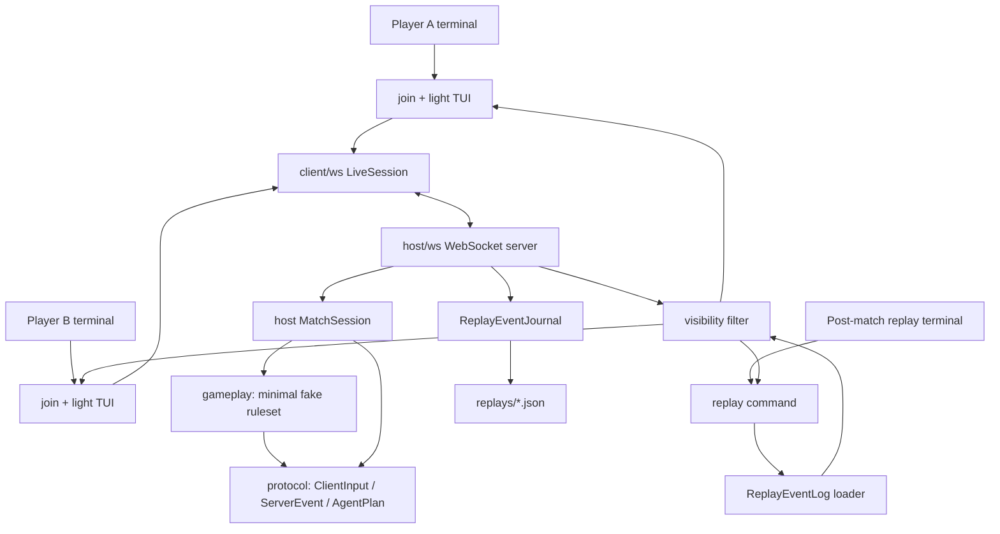

# Shrimp Cards

<p align="left">
  <a href="./README.md"></a>
  <a href="./README.en.md"></a>
  <a href="https://www.moonbitlang.com/"></a>
  <a href="./LICENSE"></a>
  
  
</p>

Shrimp Cards is a terminal-first MoonBit card-game foundation for PvE and PvP
experiments. The current code focuses on non-gameplay infrastructure: local
host/client communication, live intervention windows, replay recording, and
agent planning flow.

Gameplay rules are intentionally not defined yet. The code only includes a tiny
fake/minimal ruleset to prove that the gameplay slot, agent plans, and replay
pipeline are connected.

## Current Architecture



The `host` is the only authoritative state owner. Player clients only send input
messages. Player terminals and the replay viewer both pass through the same
`visibility` filter so hidden information is not decided in UI code. The current
replay is an event stream; real gameplay, cards, and combat resolution are not
wired in yet.

## Requirements

- MoonBit toolchain
- A terminal that can run three shell sessions

## Check The Project

```sh
moon fmt --check
moon check --target native
moon test --target native
moon test
moon info --target native
```

## Local Smoke Test

Run a host, two player clients, the ready/leave flow, and replay validation:

```sh
scripts/smoke-local.sh
```

## Run A Local Match

Print command help:

```sh
moon run cmd/main --target native -- --help
moon run cmd/main --target native -- host --help
moon run cmd/main --target native -- join --help
moon run cmd/main --target native -- replay --help
```

Start a host:

```sh
moon run cmd/main --target native -- host \
  --port 7777 \
  --match-id local-match \
  --seed 42 \
  --replay-dir replays
```

Optional heartbeat parameters:

```sh
--heartbeat-timeout-ms 30000
--heartbeat-scan-ms 1000
```

Join as player A in a second terminal:

```sh
moon run cmd/main --target native -- join \
  --name Alice \
  --lang zh \
  --host ws://127.0.0.1:7777/match
```

Optional heartbeat parameter:

```sh
--heartbeat-interval-ms 5000
```

Join as player B in a third terminal:

```sh
moon run cmd/main --target native -- join \
  --name Bob \
  --lang zh \
  --host ws://127.0.0.1:7777/match
```

Useful supervisor commands in each player terminal:

```text
/ready
/prefer <text>
/ban <text>
/lock
/leave
/lang zh
/lang en
```

The match opens the first intervention window after both players send
`/ready`. `/prefer` and `/ban` add supervisor interventions. `/lock` closes the
current window, emits fake/minimal final plans, executes one minimal ruleset
step, and opens the next window. `/leave` ends the match and saves the replay. `/lang`
changes only the current client display language; it is not sent to the host and
does not alter replay data.

## Replay

Print the full event stream:

```sh
moon run cmd/main --target native -- replay \
  --file replays/local-match.json \
  --view A \
  --mode events
```

Print events grouped by input window:

```sh
moon run cmd/main --target native -- replay \
  --file replays/local-match.json \
  --view A \
  --mode windows
```

Print replay metadata:

```sh
moon run cmd/main --target native -- replay \
  --file replays/local-match.json \
  --mode metadata
```

## CI

GitHub Actions runs formatting, native checks, native tests, default tests, and
generated interface verification on pushes to `main` and on pull requests.

## License

This project is licensed under the [MIT License](./LICENSE).
